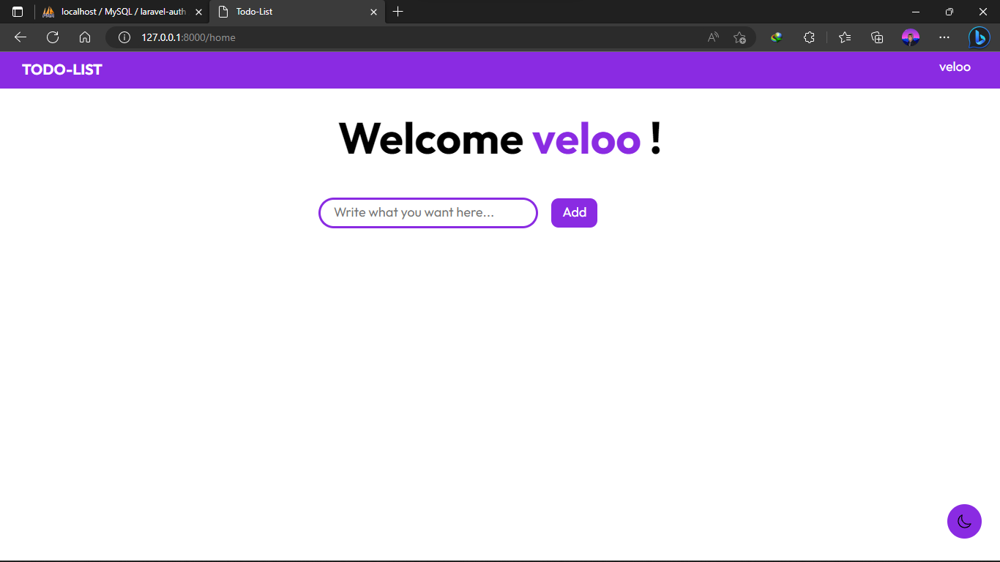
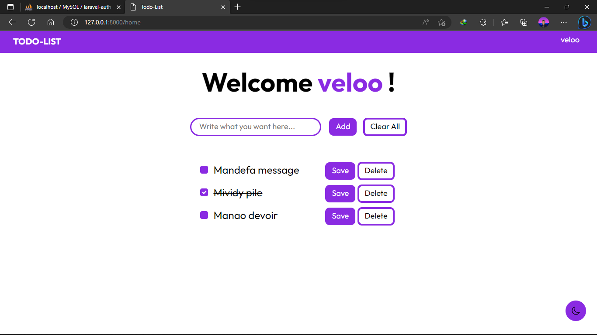
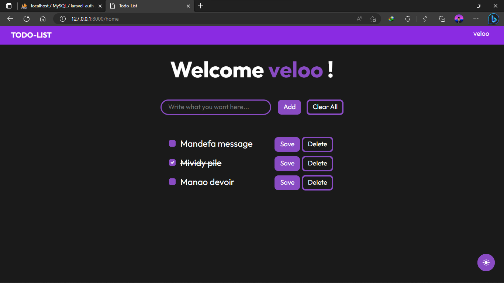
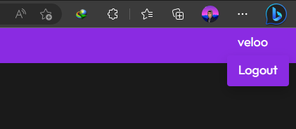

# Todo-List Application made with Laravel
This is a todo-list made with Laravel, on the backend MySql database and Blade on frontend.

## Overview
### Screenshots
#### Register

#### Login

#### Home

#### Light-mode

#### Dark-mode

#### Log-out

## Author
- Github: [Velomary Andriamasy](https://github.com/Velomary/)
- Facebook: [Velomary Andriamasy](https://www.facebook.com/velomary.andriamasy)
- Instagram: [velomary_](https://www.instagram.com/velomary_/)
- Linkedin: [Velomary](https://www.linkedin.com/in/velomary-mahavoitsy-6a2a97266?utm_source=share&utm_campaign=share_via&utm_content=profile&utm_medium=android_app)

